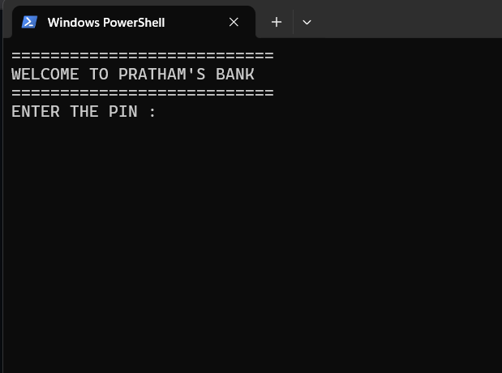
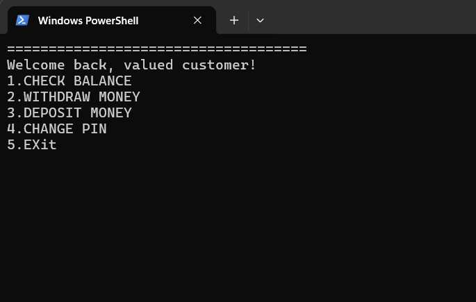
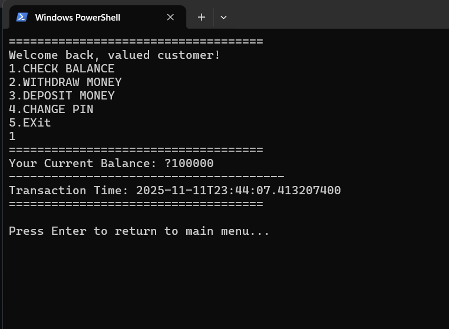
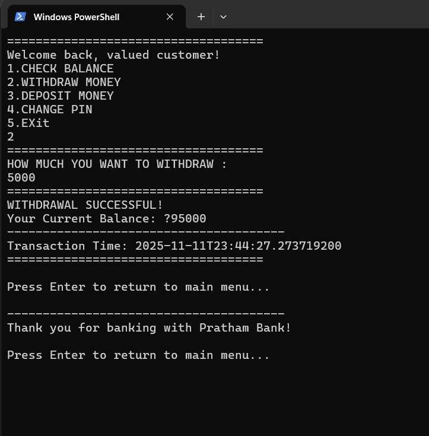
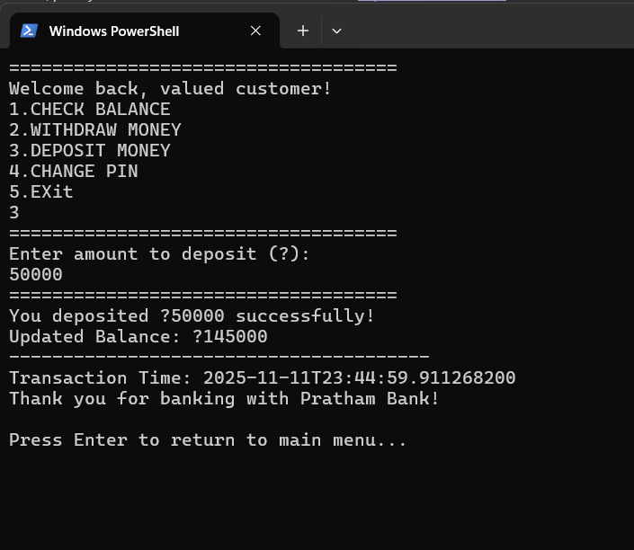
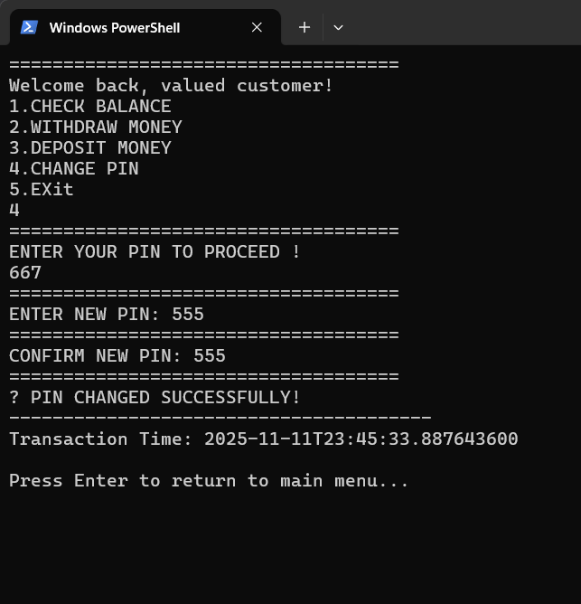
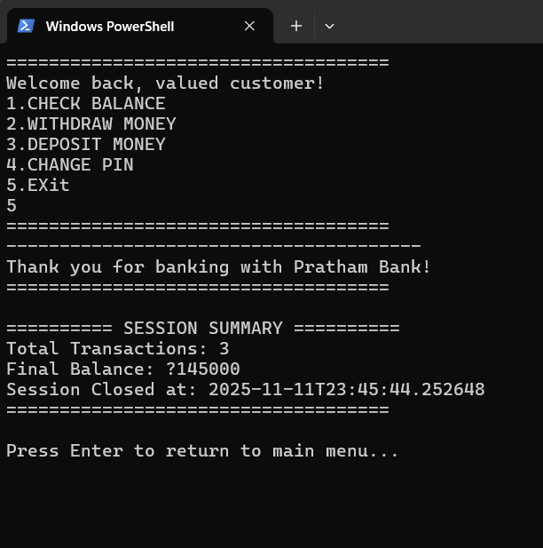

# 💳 ATM System Simulation (Java)

A console-based **ATM System in Java** that simulates core banking operations — including **balance inquiry**, **cash withdrawal**, **deposit**, and **PIN management**.  
It features a **secure login system**, **timestamped transactions**, and a **session summary** for an authentic ATM experience.

---

## 🧠 Project Overview

This project demonstrates the implementation of basic banking logic using Java.  
It focuses on **modular programming**, **user authentication**, and **real-time feedback** in a console environment.  
Designed for learning and portfolio purposes, this simulation helps strengthen understanding of control flow, input handling, and data management in Java.

---

## ⚙️ Features

✅ 3 login attempts for PIN verification  
✅ Balance inquiry with formatted output  
✅ Deposit and withdrawal functionality with validation  
✅ PIN change feature with confirmation  
✅ Transaction counter & session summary  
✅ Cross-platform screen clearing  
✅ Real-time transaction timestamps using `LocalDateTime`

---

## 🧩 Concepts Used

- Loops & Conditional Statements  
- Static Methods (Modular Programming)  
- `Scanner` Class for Input  
- `LocalDateTime` for Timestamping  
- `ProcessBuilder` for Console Management  
- Basic Exception Handling  

---

## 🧠 Future Enhancements

🚀 Planned upgrades for future versions:
- Add **multi-user support** with unique accounts  
- Implement **transaction history tracking**  
- Integrate **file-based storage or database** (MySQL)  
- Create a **GUI version** using JavaFX or Swing  
- Include **ATM card simulation** and **daily withdrawal limits**

---

## 🧑‍💻 Author

**Pratham**  
🎓 Engineering Student | 💻 Aspiring Full-Stack Developer  
🔗 [GitHub Profile](https://github.com/Pratham0667)

---

## 📄 License

This project is licensed under the **MIT License**.  
You’re free to **use, modify, and distribute** this code with proper attribution.

---

⭐ *If you find this project useful, don’t forget to give it a star on GitHub!*

## 💻 How to Run

1. **Clone this repository:**
    git clone https://github.com/Pratham0667/ATM-System-Java.git
   cd ATM-System-Java
2. **Complie the program**
   javac Atmsystem.java
3. **run the program**
     java Atmsystem

# sample output

WELCOME TO PRATHAM'S BANK

ENTER THE PIN : 667

Welcome back, valued customer!
1. CHECK BALANCE
2. WITHDRAW MONEY
3. DEPOSIT MONEY
4. CHANGE PIN
5. EXIT

## 📸 Project Screenshots

### 🏠 Home Interface

### 💡 Options Menu

### 💰 Balance Check

### 💵 Withdrawal Operation

### 💳 Deposit Operation

### 🔐 PIN Change

### 🚪 Exit Summary

